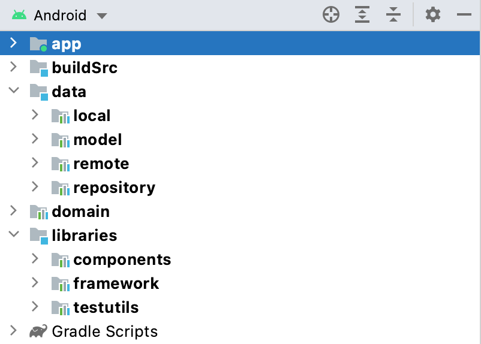

## Android Clean Architecture

[](https://ktlint.github.io/)
[](http://kotlinlang.org/)
[](https://lv.binarybabel.org/catalog/gradle/latest)
[](https://android-arsenal.com/api?level=23)
[](http://www.apache.org/licenses/LICENSE-2.0)

Android Clean Architecture in Rorty is a sample project that presents modern, approach to [Android](https://www.android.com/) application development using [Kotlin](https://kotlinlang.org/) and latest tech-stack.

The goal of the project is to demonstrate best practices, provide a set of guidelines, and present modern Android
application architecture that is modular, scalable, maintainable and testable. This application may look simple, but it
has all of these small details that will set the rock-solid foundation of the larger app suitable for bigger teams and
long application lifecycle management.

# Rorty-Android

An android app built using Kotlin that consumes [Rick and Morty API](https://rickandmortyapi.com) to display characters,episodes,Location from the [TV Series](https://www.imdb.com/title/tt2861424/). It has been built following Clean Architecture Principle, Repository Pattern, MVVM Architecture in the presentation layer as well as Jetpack components.

[](https://github.com/developersancho/Rorty.Native.Android)

## Environment Setup

In order to be able to build the application you'll need Android Studio Minimum version ```Bumblebee (2021.1.1) RC 1```

## Architecture
A well planned architecture is extremely important for an app to scale and all architectures have one common goal- to manage complexity of your app. This isn't something to be worried about in smaller apps however it may prove very useful when working on apps with longer development lifecycle and a bigger team.

Clean architecture was proposed by [Robert C. Martin](https://en.wikipedia.org/wiki/Robert_C._Martin) in 2012 in the [Clean Code Blog](http://blog.cleancoder.com/uncle-bob/2012/08/13/the-clean-architecture.html) and it follow the SOLID principle.

<p align="center"></p>

The circles represent different layers of your app. Note that:

- The center circle is the most abstract, and the outer circle is the most concrete. This is called the [Abstraction Principle](https://en.wikipedia.org/wiki/Abstraction_principle_(computer_programming)). The Abstraction Principle specifies that inner circles should contain business logic, and outer circles should contain implementation details.

- Another principle of Clean Architecture is the [Dependency Inversion](https://en.wikipedia.org/wiki/Dependency_inversion_principle). This rule specifies that each circle can depend only on the nearest inward circle ie. low-level modules do not depend on high-level modules but the other way around.

<p align="center"></p>

### Why Clean Architecture?
- ```Loose coupling between the code``` - The code can easily be modified without affecting any or a large part of the app's codebase thus easier to scale the application later on.
- Easier to ```test``` code.
- ```Separation of Concern``` - Different modules have specific responsibilities making it easier for modification and maintenance.

### S.O.L.I.D Principles

- [__Single Responsibility__](https://en.wikipedia.org/wiki/Single-responsibility_principle): Each software component should have only one reason to change – one responsibility.

- [__Open-Closed__](https://en.wikipedia.org/wiki/Open%E2%80%93closed_principle#:~:text=In%20object%2Doriented%20programming%2C%20the,without%20modifying%20its%20source%20code.): You should be able to extend the behavior of a component, without breaking its usage, or modifying its extensions.

- [__Liskov Substitution__](https://en.wikipedia.org/wiki/Liskov_substitution_principle): If you have a class of one type, and any subclasses of that class, you should be able to represent the base class usage with the subclass, without breaking the app.

- [__Interface Segregation__](https://en.wikipedia.org/wiki/Interface_segregation_principle): It’s better to have many smaller interfaces than a large one, to prevent the class from implementing the methods that it doesn’t need.

- [__Dependency Inversion__](https://en.wikipedia.org/wiki/Dependency_inversion_principle): Components should depend on abstractions rather than concrete implementations. Also higher level modules shouldn’t depend on lower level modules.

## Layers

### Project Structure
<p align="center"></p>

### 1. Data
The ```data``` layer is responsible for selecting the proper data source for the domain layer. It contains the implementations of the repositories declared in the domain layer.

Components of data layer include:
- __model__

  -__dto__: Defines dto of ui model, also perform data transformation between ```domain```, ```response``` and ```entity``` models.

  -__local__: Defines the schema of SQLite database.

  -__remote__: Defines POJO of network responses.

- __local__: This is responsible for performing caching operations using [Room](https://developer.android.com/training/data-storage/room).

- __remote__: This is responsible for performing network operations eg. defining API endpoints using [Retrofit](https://square.github.io/retrofit/).

- __repository__: Responsible for exposing data to the domain layer.

### 2. Domain
This is the core layer of the application. The ```domain``` layer is independent of any other layers thus ] domain business logic can be independent from other layers.This means that changes in other layers will have no effect on domain layer eg.  screen UI (presentation layer) or changing database (data layer) will not result in any code change withing domain layer.

Components of domain layer include:
- __usecase__: They enclose a single action, like getting data from a database or posting to a service. They use the repositories to resolve the action they are supposed to do. They usually override the operator ```invoke``` , so they can be called as a function.

### 3. Presentation
The ```app``` layer contains components involved in showing information to the user. The main part of this layer are the views(activity, fragment) and ViewModels.

## Demo Screenshots

| Mode  | Splash                                                   | Characters                                                 | Character Favorite                                        |
|-------|----------------------------------------------------------|------------------------------------------------------------|-----------------------------------------------------------|
| Light |        |      |      |
| Dark  |        | | |

| Mode  | Character Detail                                         | Settings                                                   |
|-------|----------------------------------------------------------|------------------------------------------------------------|
| Light |        |        |
| Dark  |   |   |

# Tech Stacks
This project uses many of the popular libraries, plugins and tools of the android ecosystem.

- [Jetpack](https://developer.android.com/jetpack)

  - [Android KTX](https://developer.android.com/kotlin/ktx.html) - Provide concise, idiomatic Kotlin to Jetpack and Android platform APIs.
  - [AndroidX](https://developer.android.com/jetpack/androidx) - Major improvement to the original Android [Support Library](https://developer.android.com/topic/libraries/support-library/index), which is no longer maintained.
  - [Lifecycle](https://developer.android.com/topic/libraries/architecture/lifecycle) - Perform actions in response to a change in the lifecycle status of another component, such as activities and fragments.
  - [ViewModel](https://developer.android.com/topic/libraries/architecture/viewmodel) - Designed to store and manage UI-related data in a lifecycle conscious way. The ViewModel class allows data to survive configuration changes such as screen rotations.
  - [Room](https://developer.android.com/training/data-storage/room) - Provides an abstraction layer over SQLite used for offline data caching.
  - [Paging3](https://developer.android.com/topic/libraries/architecture/paging/v3-overview) - The Paging Library makes it easier for you to load data gradually and gracefully within your app's [RecyclerView](https://developer.android.com/reference/androidx/recyclerview/widget/RecyclerView).
  - [ViewBinding](https://developer.android.com/topic/libraries/view-binding) - View binding is a feature that allows you to more easily write code that interacts with views.

- [Hilt](https://dagger.dev/hilt/) - Dependency Injection library.

- [Retrofit](https://square.github.io/retrofit/) - Type-safe http client and supports coroutines out of the box.
- [OkHttp-Logging-Interceptor](https://github.com/square/okhttp/blob/master/okhttp-logging-interceptor/README.md) - Logs HTTP request and response data.
- [Coroutines](https://github.com/Kotlin/kotlinx.coroutines) - Library Support for coroutines.
- [Flow](https://developer.android.com/kotlin/flow) - Flows are built on top of coroutines and can provide multiple values. A flow is conceptually a stream of data that can be computed asynchronously.
- [Material Design](https://material.io/develop/android/docs/getting-started/) - Build awesome beautiful UIs.
- [Coroutines](https://github.com/Kotlin/kotlinx.coroutines) - Library Support for coroutines,provides runBlocking coroutine builder used in tests.
- [Timber](https://github.com/JakeWharton/timber) - A logger with a small, extensible API which provides utility on top of Android's normal Log class.
- [Moshi](https://github.com/square/moshi) - A modern JSON library for Kotlin and Java.
- [Chucker](https://github.com/ChuckerTeam/chucker) - An HTTP inspector for Android & OkHTTP (like Charles but on device).
- [Coil](https://github.com/coil-kt/coil) - Image loading for Android backed by Kotlin Coroutines.
- [Gradle Kotlin DSL](https://gradle.org/kotlin/) - makes it easy to manage dependency all module that we have

- [Test](https://en.wikipedia.org/wiki/Unit_testing)

  - [Robolectric](http://robolectric.org/) - Running tests on an Android emulator or device is slow! Building, deploying, and launching the app often takes a minute or more. That’s no way to do TDD. There must be a better way.
  - [Mockk](https://mockk.io/) - A modern Mockk library for UnitTest.
  - [Turbine](https://github.com/cashapp/turbine) - Turbine is a small testing library for kotlinx.coroutines Flow.
  - [Truth](https://github.com/google/truth) - Truth makes your test assertions and failure messages more readable.
  - [Coroutine-Test](https://github.com/Kotlin/kotlinx.coroutines/tree/master/kotlinx-coroutines-test) - Provides testing utilities for effectively testing coroutines.
  - ...

### Plugin
- [Check-Dependency-Versions](https://github.com/ben-manes/gradle-versions-plugin) - make easy to determine which dependencies have updates.

### Code Analyze Tools
- [Ktlint](https://github.com/jlleitschuh/ktlint-gradle) - A ktlint gradle plugin. Provides a convenient wrapper plugin over the ktlint project.
- [Spotless](https://github.com/diffplug/spotless) - It’s pretty useful in automating fixes for pretty simple (and common) formatting mistakes as in spaces, newlines, removing unnecessary imports, etc.
- [Detekt](https://github.com/detekt/detekt) - Static code analysis for Kotlin.

## 🚀 Posts In Medium
***

## 🤝 Contributing

Contributions are what make the open source community such an amazing place to be learn, inspire,
and create. Any contributions you make are **greatly appreciated**.

1. Open an issue first to discuss what you would like to change.
1. Fork the Project
1. Create your feature branch (`git checkout -b feature/amazing-feature`)
1. Commit your changes (`git commit -m 'Add some amazing feature'`)
1. Push to the branch (`git push origin feature/amazing-feature`)
1. Open a pull request

Please make sure to update tests as appropriate.

## ✍️ Authors

<a href="https://www.linkedin.com/in/mesut-g-33b41030" target="_blank">
  
</a>

👤 **developersancho**

[](https://www.linkedin.com/in/mesut-g-33b41030/)
[](https://developersancho.medium.com/)

Feel free to ping me 😉

## License

```license
Copyright © 2022 - developersancho

Licensed under the Apache License, Version 2.0 (the "License");
you may not use this file except in compliance with the License.
You may obtain a copy of the License at

   http://www.apache.org/licenses/LICENSE-2.0

Unless required by applicable law or agreed to in writing, software
distributed under the License is distributed on an "AS IS" BASIS,
WITHOUT WARRANTIES OR CONDITIONS OF ANY KIND, either express or implied.
See the License for the specific language governing permissions and
limitations under the License.
```