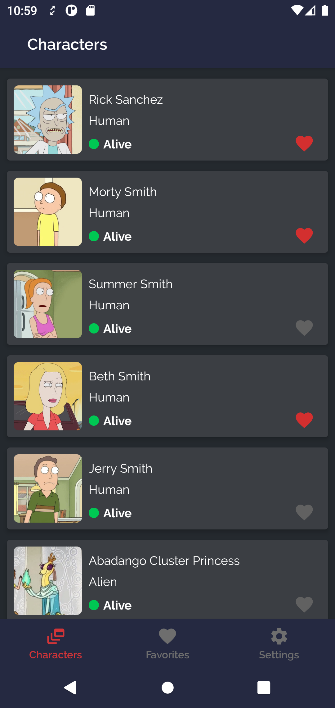

## Android Clean Architecture

[](https://ktlint.github.io/)
[](http://kotlinlang.org/)
[](https://lv.binarybabel.org/catalog/gradle/latest)
[](https://android-arsenal.com/api?level=23)
[](http://www.apache.org/licenses/LICENSE-2.0)

Android Clean Architecture in Rorty is a sample project that presents modern, approach to [Android](https://www.android.com/) application development using [Kotlin](https://kotlinlang.org/) and latest tech-stack.

The goal of the project is to demonstrate best practices, provide a set of guidelines, and present modern Android
application architecture that is modular, scalable, maintainable and testable. This application may look simple, but it
has all of these small details that will set the rock-solid foundation of the larger app suitable for bigger teams and
long application lifecycle management.

# Rorty-Android

[](https://github.com/developersancho/Rorty.Native.Android)

### Demo Screenshots

| Mode  | Splash                                                   | Characters                                                 | Character Favorite                                        |
|-------|----------------------------------------------------------|------------------------------------------------------------|-----------------------------------------------------------|
| Light |        |      |      |
| Dark  |        | | |

| Mode  | Character Detail                                         | Settings                                                   |
|-------|----------------------------------------------------------|------------------------------------------------------------|
| Light |        |        |
| Dark  |   |   |

## 🚀 Posts In This Series
***

## 🤝 Contributing

Contributions are what make the open source community such an amazing place to be learn, inspire,
and create. Any contributions you make are **greatly appreciated**.

1. Open an issue first to discuss what you would like to change.
1. Fork the Project
1. Create your feature branch (`git checkout -b feature/amazing-feature`)
1. Commit your changes (`git commit -m 'Add some amazing feature'`)
1. Push to the branch (`git push origin feature/amazing-feature`)
1. Open a pull request

Please make sure to update tests as appropriate.

## ✍️ Authors

<a href="https://www.linkedin.com/in/mesut-g-33b41030" target="_blank">
  
</a>

👤 **developersancho**

[](https://www.linkedin.com/in/mesut-g-33b41030/)
[](https://developersancho.medium.com/)

Feel free to ping me 😉

## License

```license
Copyright © 2022 - developersancho

Licensed under the Apache License, Version 2.0 (the "License");
you may not use this file except in compliance with the License.
You may obtain a copy of the License at

   http://www.apache.org/licenses/LICENSE-2.0

Unless required by applicable law or agreed to in writing, software
distributed under the License is distributed on an "AS IS" BASIS,
WITHOUT WARRANTIES OR CONDITIONS OF ANY KIND, either express or implied.
See the License for the specific language governing permissions and
limitations under the License.
```